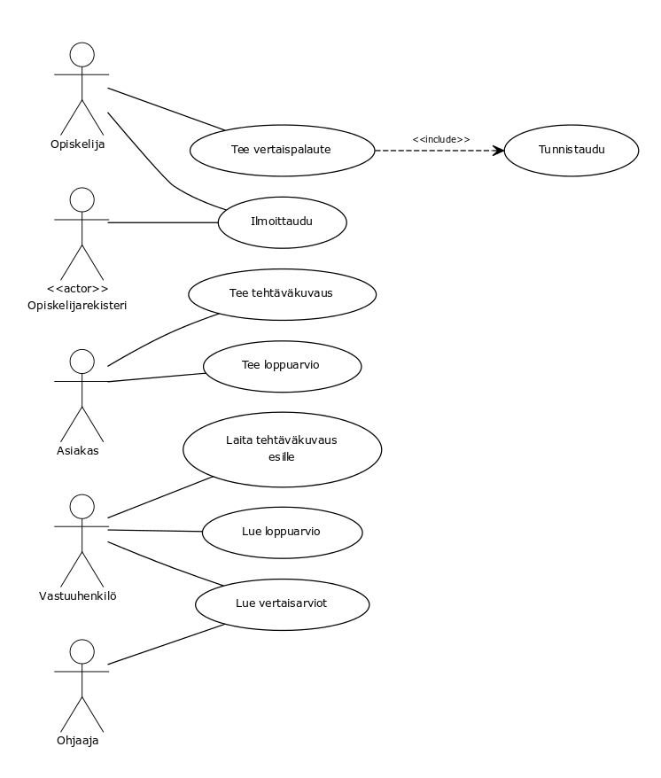
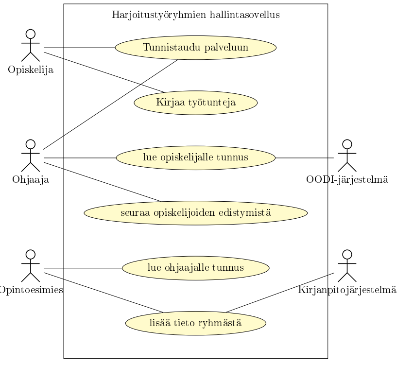

#Mallivastaukset#

##Tehtävä 1##

***Käyttäjät:***
* Asiakas
* Kurssin vastuuhenkilö
* Ryhmän ohjaaja
* Opiskelija
* Opiskelijarekisteri

***Käyttötapaukset:***
* Tehtäväkuvauksen syöttäminen
  * Asiakas syöttää tehtäväkuvauksen
* Tehtäväkuvauksen esille laittaminen
  * Vastuuhenkilö laittaa tehtäväkuvauksen esille ja salli ilmoittautumisen ryhmään
* Tunnistautuminen
  * Opiskelija tunnistautuu järjestelmään
* Ilmoittautuminen
  * Opiskelija ilmoittautuu ryhmään, ilmoittautuminen merkataan opiskelijarekisteriin
* Vertaisarvioinnin teko
  * Opiskelija suorittaa vertaisarvioinnin vastaten järjestelmän esittämiin kysymyksiin ryhmäläisistään
* Vertaisarviointien tarkastelu
  * Ryhmän ohjaaja sekä kurssin vastuuhenkilö tarkastavat opiskelijan vertaisarviot
* Loppuarvion tekeminen
  * Ryhmän asiakas laatii ryhmästä loppuarvion
* Loppuarvion ja vertaisarvion lukeminen
  * Kurssin vastuuhenkilö lukee ryhmän vertaisarviot ja loppuarvion järjestelmästä

##Tehtävä 2##

Esimerkiksi:

###Käyttötapaus: Ilmoittautuminen###
* Tavoite: Oppilas ilmoittautuu haluamaansa ryhmään, oppilaan tiedot tuodaan opiskelijarekisteristä
* Käyttäjät: Oppilas, Opiskelijarekisteri
* Esiehto: Opiskelija löytyy opiskelijarekisteristä
* Jälkiehto: Opiskelija on merkitty ilmoittautuneeksi ryhmään ja opiskelijan tiedot on tuotu opiskelijarekisteristä

####Käyttötapauksen kulku####
1. Opiskelija aloittaa ryhmien tutkimisen
2. Järjestelmä näyttää opiskelijalle valittavissa olevat ryhmät
3. Opiskelijalle näytetään kurssi-ilmoittautumisnäkymä
4. Opiskelija valitsee haluamansa ryhmän
5. Järjestelmä pyytää opiskelijaa tunnistautumaan
6. Opiskelija syöttää tunnisteen (esim. opiskelijanumero) ja aktivoi ilmoittautumistoiminnon
7. Tunnisteen perusteella järjestelmä hakee opiskelijan tiedot opiskelijarekisteristä ja tallentaa ilmoittautumisen
8. Järjestelmä kertoo opiskelijalle ilmoittautumisen onnistumisesta

####Käyttötapauksen kulku, poikkeustapaus####
<ul>
<li>4a) Opiskelija ei voi ilmoittautua ryhmään joka on täynnä</li>
<li>7b) Opiskelijaa ei löydetä tunnisteen perusteella opiskelijarekisteristä, ilmoittautuminen epäonnistuu ja opiskelija palautetaan tunnistautumiseen</li>
</ul>

###Käyttötapaus: Vertaisarviointi###
* Tavoite: Oppilas tekee arvioinnin muiden ryhmäläistensä suoritumisesta kurssilla
* Käyttäjät: Oppilas
* Esiehto: Opiskelija on kurssilla ja kuuluu ryhmään, opiskelija on tunnistautunut järjestelmään
* Jälkiehto: Opiskelijan vertaisarviot on tallennettu

####Käyttötapauksen kulku####
1. Opiskelija aloittaa vertaisarvionnin
2. Järjestelmä näyttää opiskelijalle vertaisarvionäkymän
3. Opiskelija täyttää vertaisarvionnin ja aktivoi tallennuksen
4. Järjestelmä tarkistaa että vertaisarviointi on täytetty kokonaan
5. Vertaisarviointi tallennetaan järjestelmään
5. Järjestelmä ilmoittaa opiskelijalle tallennuksen onnistumisesta

####Käyttötapauksen kulku, poikkeustapaus####
<ul>
<li>4a) Vertaisarviontia ei ole tehty kaikilta osin, opiskelija palautetaan vertaisarviointinäkymään</li>
</ul>

##Tehtävä 3##

###Käyttäjät:###
* Opiskelija
* Ryhmän ohjaaja
* Opintoesimies
* Oodi-järjestelmä
* Kurssikirjanpitojärjestelmä

###Käyttötapaukset:###
* Opiskelijat
  * Tunnistaudu palveluun
    * Esiehto: Ohjaaja on luonut käyttäjätunnuksen
    * Kulku: Opiskelija syöttää käyttäjätunnuksen ja suorittaa kirjautumisen
  * Kirjaa työtunteja: 
    * Esiehto: Opiskelija on tunnistautunut järjestelmään 
    * Kulku: Opiskelija valitsee mihin työtehtävään työaika on käytetty on käytetty ja kauan siihen kului aikaa
* Ryhmän ohjaaja:
  * Tunnistaudu palveluun
    * Esiehto: Opintoesimies on luonut ohjaajale tunnuksen oikeilla oikeuksilla
    * Kulku: Ohjaaja syöttää käyttäjätunnuksen tiedot ja suorittaa kirjautumisen
  * Seuraa opiskelijoiden edistymistä
    * Esiehto: Ohjaaja on tunnistautunut palveluun, ohjaajalle on määrätty ryhmä ja siinä on opiskelijoita
    * Kulku: Ohjaaja valitsee listasta opiskelijan kenen työtä hän haluaa seurata jonka jälkeen ohjaajalle näytetään yhteenveto oheisen opiskelijan työtunneista
* Ryhmän ohjaaja, OODI-Järjestelmä 
  * luo opiskelijalle käyttäjätunnuksen järjestelmään
    * Esiehto: OODI-järjestelmä tuntee opiskelijan
    * Kulku: Ryhmän ohjaaja luo opiskelijalle tunnuksen ja OODI-järjestelmä kopioi sille yhteystiedot omasta tietokannastaan
* Opintoesimies
  * luo ohjaajalle käyttäjätunnuksen 
    * Esiehto: Järjestelmässä on ainakin yksi ohjaaja, jolle ryhmä voidaan asettaa, kurssikirjanpitojärjestelmästä tuntee ryhmän tiedot (ohjaaja, tapaamisajat, alku- ja loppupäivämäärä)
    * Kulku: Opintoesimies valitsee ryhmän aiheen (Ohjelmointi, Tietorakenteet tai Tietokannat) ja valitsee ryhmälle ohjaajan, jonka jälkeen hän suorittaa luonnin ja ryhmän tiedot kopioidaan kurssinpitojärjestelmästä.

##Tehtävä 4##

