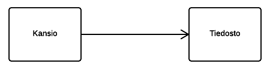
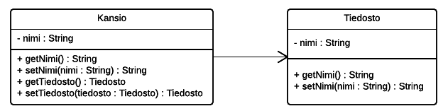
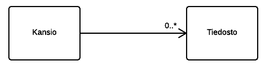
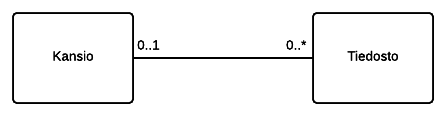
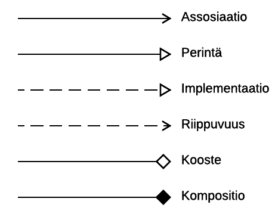
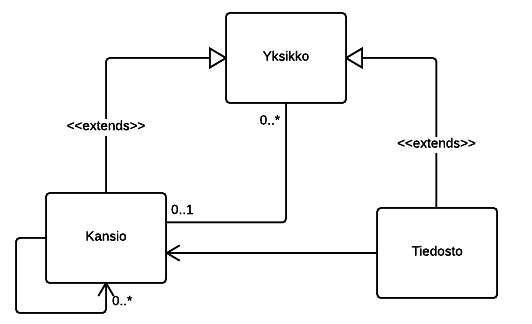

# UML Aloitusopas

Pikainen opas, joka voi auttaa ymmärtämään UML-kaavioita.

## Helppo esimerkki

Katsotaan ensin luomamme luokka, nimeltä ```Tiedosto```, jolla muuttujana ainoastaan nimi.

``` java
package fi.ooppa.otmexample;

public class Tiedosto {

    private String nimi;

    public Tiedosto(String nimi) {
        this.nimi = nimi;
    }

    public String getNimi() {
        return nimi;
    }

    public void setNimi(String nimi) {
        this.nimi = nimi;
    }

    @Override
    public String toString() {
        return nimi + ".txt";
    }
}
```

Lisäksi meillä on toinen luokka nimeltä ```Kansio```, jolla on nimi ja yksi ```Tiedosto``` olio.

``` java
package fi.ooppa.otmexample;

public class Kansio {

    private String nimi;
    private Tiedosto tiedosto;

    public Kansio(String nimi) {
        this.nimi = nimi;
    }

    public String getNimi() {
        return nimi;
    }

    public void setNimi(String nimi) {
        this.nimi = nimi;
    }

    public Tiedosto getTiedosto() {
        return tiedosto;
    }

    public void setTiedosto(Tiedosto tiedosto) {
        this.tiedosto = tiedosto;
    }

    @Override
    public String toString() {
        return nimi + "/" + tiedosto.toString();
    }
}
```

Main-metodimme näyttää seuraavalta ja tulostaa tekstin: ```src/tiedosto.txt```.

``` java
package fi.ooppa.otmexample;

public class Main {

    public static void main(String[] args) {
        Tiedosto tiedosto = new Tiedosto("tiedosto");
        Kansio kansio = new Kansio("src");
        kansio.setTiedosto(tiedosto);

        System.out.println(kansio);
    }
}
```

### Yksinkertainen UML-kaavio

Oheisen esimerkin UML-malli näyttää seuraavalta:



Koska ```Kansio``` tuntee tasan yhden ```Tiedoston``` ja ```Tiedosto``` ei tunne ```Kansiota``` tulee kahden luokan väliin viiva, jolla on nuolenkärki osoittamassa *navigoinnin suuntaa*. Käytännössä siis ```Kansio``` voi kutsua ```Tiedosto``` -luokan metodeja, mutta ```Tiedosto``` ei voi kutsua ```Kansio``` -luokan metodeja.

Jos haluamme kuvata tarkermmin luokkien sisältöä voimme kuvata sitä seuraavasti:



UML kaavioissa käytettävistä määrittelyistä tarkemmin tietoa saa luentokalvoista ja kurssimonisteesta.

### Kytkentärajoitteet

Edellinen esimerkkimme oli huono, koska kansioissa voi olla useita tiedostoja, joten muokkaamme ohjelmakoodia seuraavasti:

``` java
package fi.ooppa.otmexample;

import java.util.ArrayList;

public class Kansio {

    private String nimi;
    private ArrayList<Tiedosto> tiedostot;

    public Kansio(String nimi) {
        this.nimi = nimi;
        this.tiedostot = new ArrayList<>();
    }

    public String getNimi() {
        return nimi;
    }

    public void setNimi(String nimi) {
        this.nimi = nimi;
    }

    public ArrayList<Tiedosto> getTiedostot() {
        return tiedostot;
    }

    public void lisaaTiedosto(Tiedosto tiedosto) {
        if (tiedosto != null) {
            tiedostot.add(tiedosto);
        }
    }

    @Override
    public String toString() {

        return "/" + nimi + " (kansiossa on " + tiedostot.size() + " tiedostoa)";
    }

}
```

Lisäksi muokataan Main-metodia, mutta jätetään ```Tiedosto``` -luokka ennalleen.

``` java
package fi.ooppa.otmexample;

public class Main {

    public static void main(String[] args) {
        Kansio kansio = new Kansio("src");
        kansio.lisaaTiedosto(new Tiedosto("kauppalista"));
        kansio.lisaaTiedosto(new Tiedosto("muistiinpanot"));

        System.out.println(kansio);
    }
}
```

Nyt meidän ohjelmoimassa kansiossa voi olla *0-n* kappaletta tiedostoja, joka merkataan UML-kaavioon ```0..*``` merkinnällä.



## Kaksisuuntainen yhteys

Voisi olla hyödyllistä, että tiedosto tietäisi missä kansiossa se sijaitsee, joten teemme taas muokkauksia sovellukseen. Aloitetaan lisäämällä ```Tiedostolle``` uusi muuttuja nimeltä *kansio*:

``` java
package fi.ooppa.otmexample;

public class Tiedosto {

    private String nimi;
    private Kansio kansio;

    public Tiedosto(String nimi) {
        this.nimi = nimi;
    }

    public String getNimi() {
        return nimi;
    }

    public void setNimi(String nimi) {
        this.nimi = nimi;
    }

    public Kansio getKansio() {
        return kansio;
    }

    public void setKansio(Kansio kansio) {
        this.kansio = kansio;
    }

    @Override
    public String toString() {
        return nimi + ".txt";
    }

}
```

Lisäksi tehdän muutos ```Kansio``` -luokkaan, jotta kansio tallennetaan muistiin tiedostolle kun tiedosto lisätään kansioon:

``` java
public void lisaaTiedosto(Tiedosto tiedosto) {
    if (tiedosto != null) {
        tiedosto.setKansio(this);
        tiedostot.add(tiedosto);
    }
}
```

Nyt kaavio näyttää seuraavalta:



Voimme siis tulkita, että kansiossa on 0-n tiedostoa ja tiedosto kuuluu 0-1 kansioon.

## Erilaisia yhteysviivoja

Voimme merkitä erilaisia yhteyksiä luokkien välillä seuraavilla viivoilla:



Ottakaamme näistä viivoista siis mallia... Esimerkissämme on edelleen suuri puute, sillä kansiossa voi olla tiedostojen lisäksi myös toisia kansioita. Päädymme siis luomaan uuden luokan nimeltä ```Yksikko```, jonka sisältö näyttää seuraaalta (tässä voisi toteuttaa *abstraktin luokan*, mutta pitääksemme esimerkkiä yksinkertaisena vältetään sen käyttöä tälläkertaa):

``` java
package fi.ooppa.otmexample;

public class Yksikko {

    private String nimi;
    private Kansio kansio;

    public Yksikko(String nimi) {
        this.nimi = nimi;
    }

    public String getNimi() {
        return nimi;
    }

    public void setNimi(String nimi) {
        this.nimi = nimi;
    }

    public Kansio getKansio() {
        return kansio;
    }

    public void setKansio(Kansio kansio) {
        this.kansio = kansio;
    }

    public boolean onkoJuuressa() {
        return kansio==null;
    }

    @Override
    public String toString() {
        return nimi;
    }

}

```

Muokataan seuraavaksi ```Tiedosto``` -luokka *extendaamaan* luomaamme yksikköä seuraavasti:

``` java
package fi.ooppa.otmexample;

public class Tiedosto extends Yksikko {

    private Kansio kansio;

    public Tiedosto(String nimi) {
        super(nimi);
    }

    @Override
    public String toString() {
        return super.getNimi() + ".txt";
    }

}

```

Tehdään sama luokalle ```Kansio``` seuraavasti:

``` java
package fi.ooppa.otmexample;

import java.util.ArrayList;

public class Kansio extends Yksikko {

    private ArrayList<Yksikko> yksikot;
    private Kansio kansio;

    public Kansio(String nimi) {
        super(nimi);
        this.yksikot = new ArrayList<>();
    }

    public ArrayList<Yksikko> getYksikot() {
        return yksikot;
    }

    public void lisaaYksikko(Yksikko yksikko) {
        if (yksikko != null) {
            yksikko.setKansio(this);
            yksikot.add(yksikko);
        }
    }

    @Override
    public String toString() {
        return "/" + super.getNimi() + " (kansiossa on " + yksikot.size() + " tiedostoa)";
    }

}
```

Huomaathan, että edellisessä koodipätkässä lisäsimme myös ```Kansiolle``` toiminnallisuuden sille, että se tietää jos se sijaitsee toisessa kansiossa. Tätä ominaisuutta ei ollut ennen tätä muutosta.

Siirrytään vielä muokkaamaan Main-metodi vastaamaan uutta esimerkkiämme:

``` java
package fi.ooppa.otmexample;

public class Main {

    public static void main(String[] args) {
        Kansio kansio = new Kansio("src");
        kansio.lisaaYksikko(new Tiedosto("kauppalista"));
        kansio.lisaaYksikko(new Tiedosto("muistiinpanot"));

        Kansio kansio2 = new Kansio("vanhat");
        kansio2.lisaaYksikko(new Tiedosto("viimeviikon_kauppalista"));
        kansio.lisaaYksikko(kansio2);

        System.out.println(kansio);
    }
}
```

Nyt voimme merkitä nykyistä esimerkkiämme UML-kaaviossa seuraavasti:



Kaaviosta voi päätellä, että ```Kansio``` ja ```Tiedosto``` laajentavat ```Yksikko``` -luokan toimintaa. ```Kansiossa``` voi olla 0-n ```Kansiota``` tai ```Tiedostoa``` ja ```Kansio``` tai ```Tiedosto``` voi taasen olla 0:ssa tai 1:ssä ```Kansiossa```.
